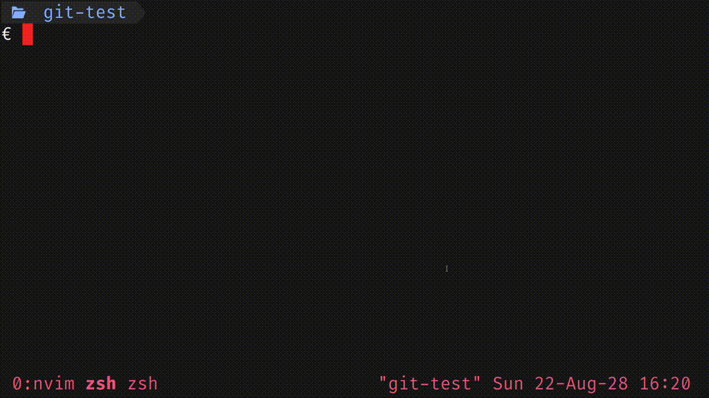
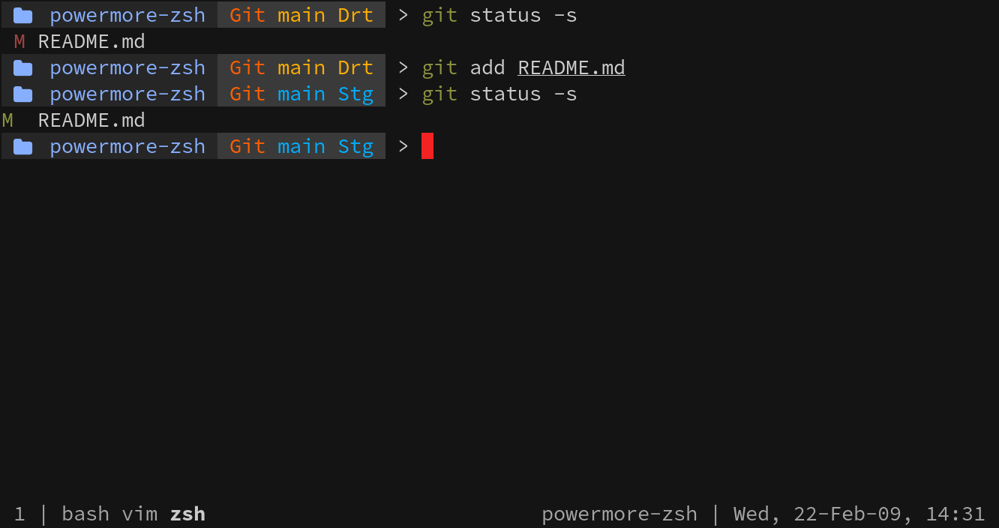
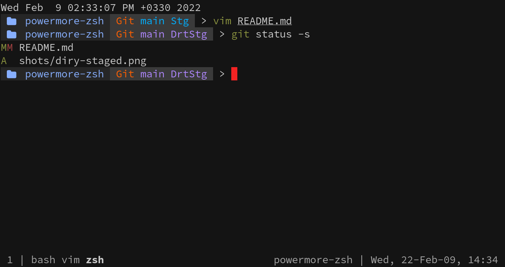
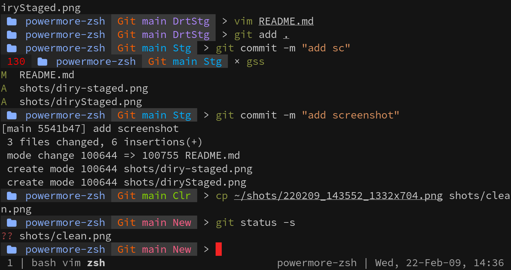

# powermore-zsh
a fork of `powerless` ZSH plugin

Simple and interactive zsh prompt for showing the git
status of current directory

**Get it:**

```sh
git clone https://github.com/primejade/powermore-zsh
```

**See the help:**

```
$ ./make.sh -h
powermore-zsh plugin, a fork of powerless plugin.
I just added some more git functionalities to it.
for more details checkout the base project.
Version 0.2

Usage: [ ./make.sh ] or [ bash make.sh ]

Running this script without any arguments will backup
the current ~/.zshrc and ~/.zsh.d (if there is any already)
and copy the new config files into your $HOME directory.

Arguments:
	-h print this message
	-v print version and exit
	-r removes the backup files
	   for having a cleaner home folder ;)

Wanna fork it?
		https://github.com/primejade/powermore-zsh

The powerless project:
		https://github.com/martinrotter/powerless
```

**Gif:**



<!-- show screenshots [version 0.1] -->
<!--
**Screenshots:**






-->
